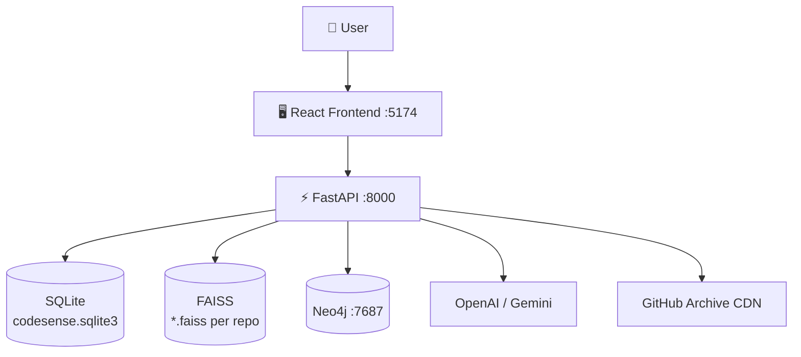

<div align="center">

# 🔍 CodeSense

**AI-powered codebase intelligence — semantic search, call graphs, and execution flow synthesis without executing a single line of code.**

[](https://fastapi.tiangolo.com)
[](https://react.dev)
[](https://neo4j.com)
[](https://python.org)
[](backend/tests/)
[](docker-compose.yml)
[](LICENSE)

</div>

---

## What is CodeSense?

Upload a ZIP archive or paste a public GitHub URL. CodeSense statically analyses the repository — no code is ever executed — and gives you:

| Capability | Description |
|---|---|
| 🔎 Semantic Search | FAISS vector search over AST-chunked source |
| 🔤 Keyword Search | BM25Okapi for exact identifier matching |
| 🔀 Hybrid Retrieval | Reciprocal Rank Fusion (RRF, k=60) |
| 🤖 Grounded Answers | LLM answers cited against source excerpts |
| 📞 Call Graph | Tree-sitter CST → function-call edges in SQLite + Neo4j |
| 📦 Dependency Graph | Import/export resolution (Python, TypeScript, JavaScript) |
| 🕸️ Graph Traversal | Multi-hop Cypher queries up to configurable depth |
| 🌊 Execution Flow | BFS + Kahn's topological sort → Mermaid diagram + LLM prose |
| 📊 Eval Harness | Precision@k, Recall@k, MRR, p50/p95 latency |

---

## Tech Stack

| | Backend | Frontend | Infrastructure |
|---|---|---|---|
| **Core** | FastAPI 0.115 · Python 3.12 | React 18 · Vite | Docker Compose |
| **Analysis** | Tree-sitter 0.25 (Python + TS/JS) | Framer Motion · Mermaid 11 | `python:3.12-slim` |
| **Search** | FAISS-cpu 1.15 · rank-bm25 | react-syntax-highlighter | `node:22-alpine` |
| **Graphs** | Neo4j 5 · SQLite 3 | Radix UI · Lucide React | Named Docker volumes |
| **LLM** | OpenAI-compatible API (also Gemini) | ReactMarkdown + remark-gfm | — |

---

## Architecture



**13-phase pipeline:**

```
Upload → Scan → Parse → Chunk → Embed → Hybrid Search → Answer
                   ↓
              Call Graph ──→ Neo4j Traversal
              Dep Graph  ──→ Neo4j Traversal
              Call Graph + Search ──→ Flow Synthesis (BFS + Topo + Mermaid)
```

---

## Quick Start

### Docker (recommended)

```bash
git clone https://github.com/your-username/codesense.git
cd codesense
echo "OPENAI_API_KEY=your_key" > .env   # optional — enables grounded answers
docker compose up --build
```

| Service | URL |
|---|---|
| Frontend | http://localhost:5174 |
| API + Swagger | http://localhost:8000/docs |
| Neo4j Browser | http://localhost:7474 |

### Local Dev

```bash
# Backend
cd backend && pip install -r requirements.txt
uvicorn app.main:app --reload --port 8000

# Frontend
cd frontend && npm install && npm run dev

# Tests
cd backend && pytest tests/ -v   # 19 tests, all passing
```

---

## Environment Variables

| Variable | Default | Description |
|---|---|---|
| `OPENAI_API_KEY` | — | OpenAI **or** Gemini key (`AQ.`/`AIzaSy` prefix auto-detected) |
| `ANSWER_MODEL` | `gpt-5-mini` | LLM model; auto-switches to `gemini-2.5-flash` for Gemini keys |
| `EMBEDDING_MODEL` | `sentence-transformers/all-MiniLM-L6-v2` | HuggingFace embedding model |
| `CODESENSE_DATA_DIR` | `data` | SQLite + FAISS storage directory |
| `NEO4J_URI` | `bolt://localhost:7687` | Neo4j Bolt connection URI |
| `NEO4J_USER` / `NEO4J_PASSWORD` | `neo4j` / `password` | Neo4j credentials |
| `CORS_ORIGINS` | `http://localhost:5173` | Comma-separated allowed origins |

---

## API Reference

Base URL: `http://localhost:8000` · Interactive docs: `/docs`

<details>
<summary><b>Uploads</b></summary>

| Method | Endpoint | Description |
|---|---|---|
| `GET` | `/api/uploads` | List repositories |
| `POST` | `/api/uploads` | Upload ZIP (≤ 50 MiB) |
| `POST` | `/api/uploads/git` | Register GitHub URL |
| `DELETE` | `/api/uploads/{id}` | Delete repo + all data |
| `POST` | `/api/uploads/{id}/fetch` | Download GitHub archive |

</details>

<details>
<summary><b>Pipeline</b></summary>

| Method | Endpoint | Description |
|---|---|---|
| `POST` | `/api/uploads/{id}/scan` | Index source files |
| `POST` | `/api/uploads/{id}/parse` | Tree-sitter symbol extraction |
| `POST` | `/api/uploads/{id}/chunk` | AST-boundary chunking |
| `POST` | `/api/uploads/{id}/embed` | Generate + persist FAISS index |
| `GET` | `/api/uploads/{id}/files` | List files |
| `GET` | `/api/uploads/{id}/symbols` | List symbols |
| `GET` | `/api/uploads/{id}/chunks` | List chunks |

</details>

<details>
<summary><b>Search, Graphs, Flow</b></summary>

| Method | Endpoint | Description |
|---|---|---|
| `POST` | `/api/uploads/{id}/similarity-search` | Raw FAISS vector search |
| `POST` | `/api/uploads/{id}/hybrid-search` | BM25 + FAISS via RRF |
| `POST` | `/api/uploads/{id}/answer` | Grounded LLM answer + citations |
| `POST` | `/api/uploads/{id}/call-graph` | Build call graph |
| `GET` | `/api/uploads/{id}/call-graph` | Query edges (`function_name`, `path`) |
| `GET` | `/api/uploads/{id}/call-graph/traverse` | Multi-hop Neo4j traversal |
| `POST` | `/api/uploads/{id}/dependency-graph` | Build dep graph |
| `GET` | `/api/uploads/{id}/dependency-graph` | Query deps (`path`) |
| `GET` | `/api/uploads/{id}/dependency-graph/traverse` | Multi-hop Neo4j traversal |
| `POST` | `/api/uploads/{id}/flow` | Execution flow (steps + Mermaid + prose) |
| `POST` | `/api/uploads/{id}/evaluate` | Retrieval eval harness |
| `GET` | `/health` | Health check |

</details>

---

## Database Schema

SQLite (`codesense.sqlite3`) + per-repo FAISS `.faiss` files:

```sql
uploads              (id, source_type, original_name, location, created_at)
file_metadata        (upload_id, path, language, size_bytes, content)
code_symbols         (upload_id, path, kind, name, start_line, end_line)
chunks               (upload_id, path, start_line, end_line, content, symbol_name)
call_graph_edges     (upload_id, caller_path, caller_name, caller_line, callee_path, callee_name, call_line)
dependency_graph_edges (upload_id, source_path, target_path, import_specifier, is_external, line_number)
```

Neo4j nodes: `Function {name, path, upload_id}` · `Module {path, is_external, upload_id}`  
Neo4j edges: `CALLS {line}` · `DEPENDS_ON {line, specifier}`

---

## Security

| Threat | Mitigation |
|---|---|
| Code execution | Tree-sitter CST only — no `eval`, `exec`, subprocess, or `import` on user content |
| Path traversal | `..` and absolute paths rejected at scan time |
| Archive bomb | 200 MiB uncompressed limit; 50 MiB upload limit |
| SSRF | Only `https://github.com/owner/repo` URLs; fetches `codeload.github.com` only |
| Prompt injection | System prompt instructs LLM to ignore instructions in code excerpts |
| Hallucination | Citation IDs validated against context before response is returned |
| Rate limiting | Embedding client: threading lock + 200 ms minimum interval |

---

## Folder Structure

```
CodeSense/
├── docker-compose.yml
├── .env                        # OPENAI_API_KEY (gitignored)
├── backend/
│   ├── Dockerfile
│   ├── requirements.txt
│   ├── app/
│   │   ├── main.py             # 20 REST endpoints
│   │   ├── models.py           # Pydantic models
│   │   ├── config.py           # Settings + dotenv
│   │   ├── storage.py          # SQLite UploadStore
│   │   ├── scanner.py          # ZIP scanner
│   │   ├── parser.py           # Tree-sitter symbols
│   │   ├── chunker.py          # AST-aware chunker
│   │   ├── embed.py            # FAISS + SentenceTransformers
│   │   ├── bm25.py             # BM25 + RRF
│   │   ├── answer.py           # LLM grounded Q&A
│   │   ├── callgraph.py        # Call graph extractor
│   │   ├── depgraph.py         # Dependency graph extractor
│   │   ├── neo4j_client.py     # Cypher queries
│   │   ├── flow_synthesizer.py # BFS + topo sort + Mermaid
│   │   ├── gitfetch.py         # GitHub archive downloader
│   │   └── eval_api.py         # Eval harness router
│   ├── eval/
│   │   ├── harness.py          # CLI + metrics
│   │   └── queries.json        # Benchmark queries
│   └── tests/
│       └── test_uploads.py     # 19 pytest tests
└── frontend/
    ├── Dockerfile
    ├── package.json
    └── src/
        ├── main.jsx            # App shell + state
        ├── styles.css          # Tailwind v4 tokens
        └── components/
            ├── library/        # Import screen
            ├── workspace/      # Explorer + Editor + Chat
            └── ui/             # Radix primitives
```

---

## Future Enhancements

- [ ] Rust, Go, Java, C# Tree-sitter parsers
- [ ] Interactive D3.js call/dependency graph viewer in the UI
- [ ] Streaming LLM answers via Server-Sent Events
- [ ] Incremental indexing (re-index only changed files)
- [ ] JWT auth + per-user repository isolation
- [ ] GitHub App webhook for automatic indexing on push
- [ ] FAISS `IndexIVFFlat` for repos with > 100k chunks

---

## Contributing

```bash
# 1. Fork + create a branch
git checkout -b feature/my-feature

# 2. Make changes, ensure tests pass
cd backend && pytest tests/ -v

# 3. Commit + push + open a PR
git commit -m "feat: describe your change"
```

- **Python**: PEP 8, type-annotated, never execute user content
- **React**: Functional components and hooks only
- Add a pytest test for any new API endpoint

---

## License

MIT © 2026 CodeSense Contributors